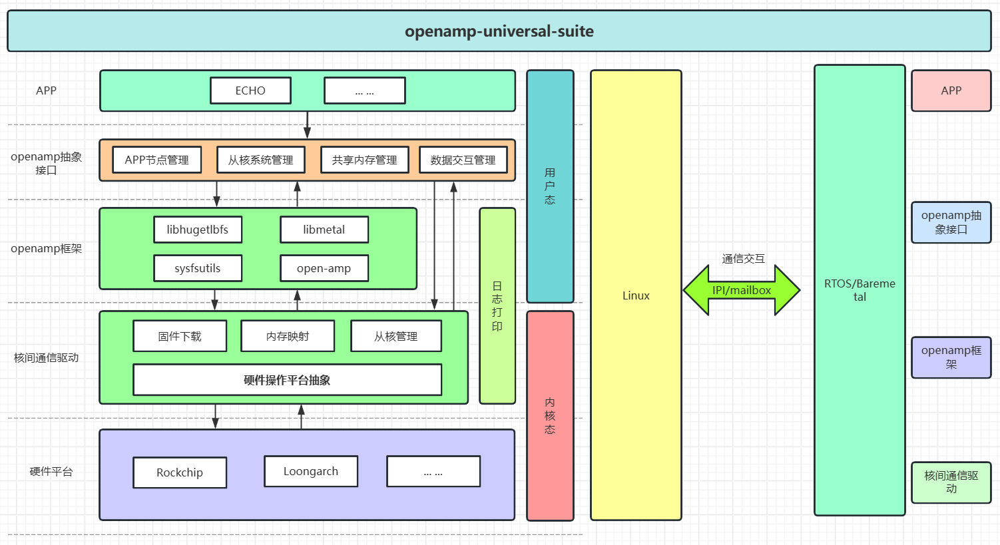
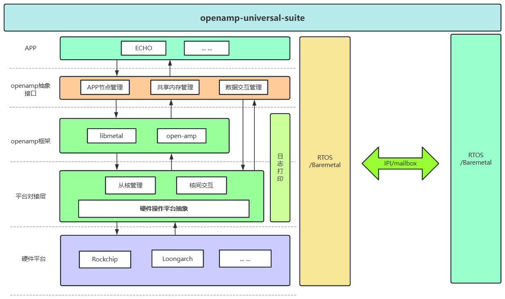

# openamp-universal-suite

一种通用的 OpenAMP 异构部署方案，旨在简化和加速异构多核系统的开发与集成。

---

## 项目简介

`openamp-universal-suite` 提供一整套用于异构多核系统的工具链与运行时库，基于 [OpenAMP](https://www.openampproject.org/) 框架构建，聚焦 **跨核通信**、**资源协作** 与 **从核管理**，帮助开发者快速构建和部署多核协作系统。

适用于如瑞芯微、loongarch 等多种异构平台。

---

## 方案特性

- **跨核通信支持**：集成 IPI 与邮箱机制。
- **从核管理**：主核可控制从核的动态启动与关闭。
- **资源管理**：共享内存与系统资源的动态分配与同步。
- **动态app节点创建**：可动态删除与创建app 节点。
- **模块化设计**：插件式架构，便于适配不同平台。
- ---

## 方案架构图





---

## 项目结构
```c
openamp-universal-suite/
├── build.sh 				# 源码拉取脚本
├── openamp_core    		# 核心通信协议栈封装
├── intercore_driver  		# 核间通信驱动及平台适配层
└── readme             		# 使用说明文档
```

---

## 快速开始

### 构建工程

```bash
./build.sh
```
### 根据文档编译
请查看以下文件获取详细信息：

- openamp_core/README.md

- intercore_driver/README.md

