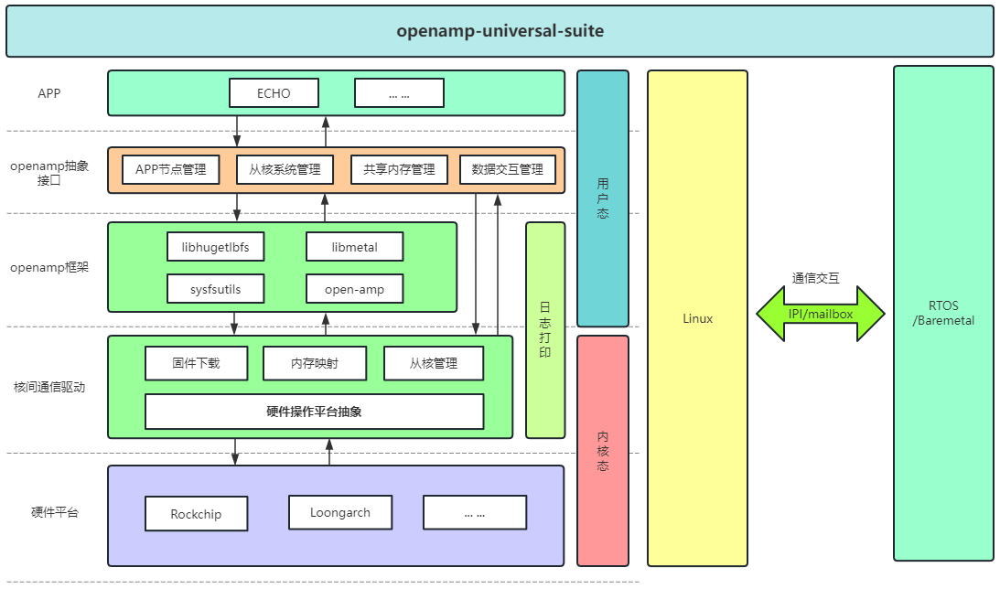

# openamp-universal-suite

一种通用的 OpenAMP 异构部署方案，旨在简化和加速异构多核系统的开发与集成。

---

## 项目简介

`openamp-universal-suite` 提供一整套用于异构多核系统的工具链与运行时库，基于 [OpenAMP](https://www.openampproject.org/) 框架构建，聚焦 **跨核通信**、**资源协作** 与 **从核管理**，帮助开发者快速构建和部署多核协作系统。

适用于如瑞芯微、loongarch 等多种平台。

---

## 方案特性

- **跨核通信支持**：集成 IPI 与邮箱机制。
- **从核管理**：主核可控制从核的动态启动与关闭。
- **资源管理**：共享内存与系统资源的动态分配与同步。
- **动态app节点创建**：可动态删除与创建app 节点。
- **模块化设计**：插件式架构，便于适配不同平台。

## 方案架构图




---

## 项目结构
```c
openamp-universal-suite/
├── build.sh 				# 源码拉取脚本
├── openamp_core    		# 核心通信协议栈封装
├── intercore_driver  		# 核间通信驱动及平台适配层
└── readme             		# 使用说明文档
```

---

## 快速开始

### 构建工程

使用如下命令自动拉取源码工程

```bash
./build.sh
```
### 根据文档编译
请查看以下文件获取详细信息：

- openamp_core/README.md（openamp_core地址：https://github.com/Bottom-farmer/openamp_core.git）
- intercore_driver/README.md（intercore_driver地址：https://github.com/Bottom-farmer/intercore_driver.git）

## 异构系统方案验证

本次验证使用Loongarch平台进行验证，采用0核心运行linux，1核心运行rtthread。

### 从核启动

验证linux从核启动rtthread。


### APP节点验证

验证linux注册/删除app节点，rtthread同步自动注册/删除app节点；


验证rtthread注册/删除app节点，linux同步自动注册/删除app节点；


验证linux使用echo发送数据到rtthread；


验证rtthread使用echo发送数据到linux。


## 同构系统方案验证

本次验证使用Loongarch平台进行验证，采用0核心运行rtthread，1核心运行rtthread。

### 从核启动

验证0核心rtthread启动1核心rtthread。


### APP节点验证

验证0核心rtthread注册/删除app节点，1核心rtthread同步自动注册/删除app节点；


验证1核心rtthread注册/删除app节点，0核心rtthread同步自动注册/删除app节点；


验证0核心rtthread使用echo发送数据到1核心rtthread；


验证1核心rtthread使用echo发送数据到0核心rtthread。


## 注意

RTOS/裸机适配软件包地址：https://github.com/Bottom-farmer/open-amp.git

